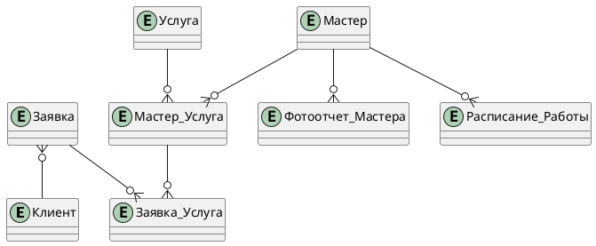

# Схема

**Связи между сущностями:** 

-  "Клиент" и "Заявка": Один клиент может иметь много заявок (1:N).

- "Мастер" и "Услуга": Один мастер может выполнять много услуг, одна услуга может выполняться разными мастерами, поэтому создается таблица Мастер_Услуга

- "Услуга" и "Мастер_Услуга": Один запрос может включать много услуг (N:M) — для разрешения связи многие ко многим создается связывающая таблица "Заявка_Услуга". Так, "Услуга" и "Заявка_Услуга" имеют связь один ко многим (1:N), и "Мастер_Услуга" и "Заявка_Услуга" имеют связь один ко многим.

- "Мастер" и "Фотоотчет": Один мастер может иметь много фотоотчетов (1:N).

- "Мастер" и "Расписание": Один мастер может иметь разное расписание в разные дни, т к выходные у мастеров в салоне не обязательно приходятся на субботу и воскресенье (1:N).

