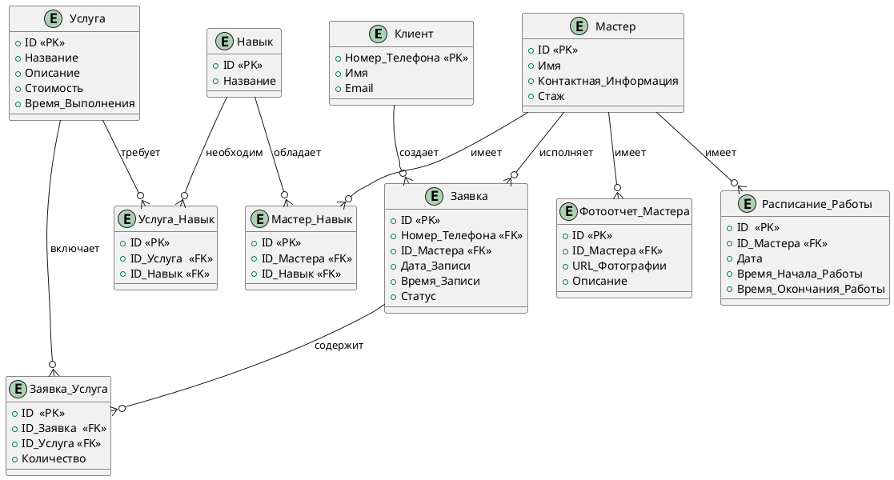

# Схема

```plantuml

@startuml

entity "Клиент" {
    + Номер_Телефона <<PK>>
    + Имя 
    + Email 
}

entity "Мастер" {
    + ID <<PK>>
    + Имя  
    + Контактная_Информация 
    + Стаж 
}

entity "Заявка" {
    + ID <<PK>>
    + Номер_Телефона <<FK>>
    + ID_Мастера <<FK>>
    + Дата_Записи 
    + Время_Записи 
    + Статус 
}

entity "Услуга" {
    + ID <<PK>>
    + Название 
    + Описание 
    + Стоимость 
    + Время_Выполнения 
}

entity "Навык" {
    + ID <<PK>>
    + Название  
}

entity "Услуга_Навык" {
    + ID <<PK>>
    + ID_Услуга  <<FK>>
    + ID_Навык <<FK>>
}

entity "Заявка_Услуга" {
    + ID  <<PK>>
    + ID_Заявка  <<FK>>
    + ID_Услуга <<FK>>
    + Количество  
}

entity "Мастер_Навык" {
    + ID <<PK>>
    + ID_Мастера <<FK>>
    + ID_Навык <<FK>>
}

entity "Фотоотчет_Мастера" {
    + ID <<PK>>
    + ID_Мастера <<FK>>
    + URL_Фотографии 
    + Описание 
}

entity "Расписание_Работы" {
    + ID  <<PK>>
    + ID_Мастера <<FK>>
    + Дата 
    + Время_Начала_Работы 
    + Время_Окончания_Работы 
}

"Клиент" --o{ "Заявка" : "создает"
"Мастер" --o{ "Заявка" : "исполняет"
"Заявка" --o{ "Заявка_Услуга" : "содержит"
"Услуга" --o{ "Заявка_Услуга" : "включает"
"Услуга" --o{ "Услуга_Навык" : "требует"
"Навык" --o{ "Услуга_Навык" : "необходим"
"Мастер" --o{ "Мастер_Навык" : "имеет"
"Навык" --o{ "Мастер_Навык" : "обладает"
"Мастер" --o{ "Фотоотчет_Мастера" : "имеет"
"Мастер" --o{ "Расписание_Работы" : "имеет"

@enduml


```

Логическая модель помогает разработчикам и аналитикам понять требования к данным и спроектировать эффективную и масштабируемую базу данных.