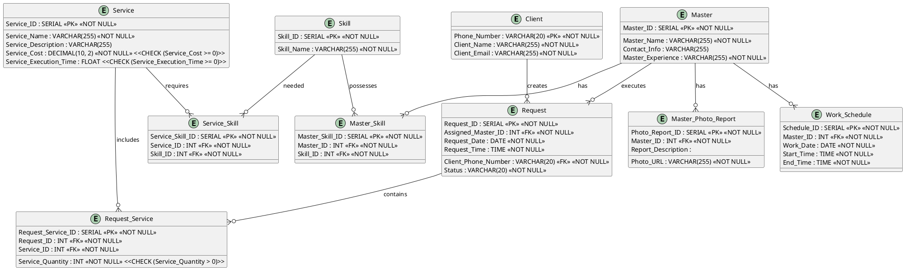

# Схема

Физические модели данных используются для планирования и оптимизации процессов и систем хранения данных. Физические модели данных представляют собой строгую схему хранения данных в реляционной базе данных.