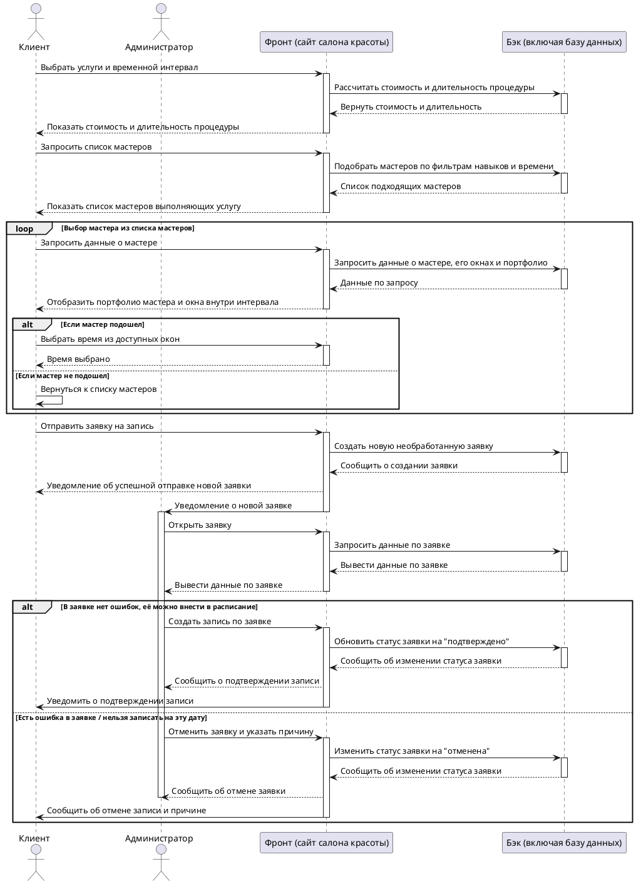

# Схема

```plantuml

@startuml

actor Клиент

actor Администратор

participant "Фронт (сайт салона красоты)" as s

participant "Бэк (включая базу данных)" as db

Клиент -> s : Выбрать услуги и временной интервал

activate s

s -> db : Рассчитать стоимость и длительность процедуры

activate db

db --> s : Вернуть стоимость и длительность

deactivate db

s --> Клиент : Показать стоимость и длительность процедуры

deactivate s

Клиент -> s : Запросить список мастеров

activate s

s -> db : Подобрать мастеров по фильтрам навыков и времени

activate db

db --> s : Список подходящих мастеров

deactivate db

s --> Клиент : Показать список мастеров выполняющих услугу

deactivate s

loop Выбор мастера из списка мастеров

Клиент -> s : Запросить данные о мастере

activate s

s -> db : Запросить данные о мастере, его окнах и портфолио

activate db

db --> s : Данные по запросу

deactivate db

s --> Клиент : Отобразить портфолио мастера и окна внутри интервала

deactivate s

alt Если мастер подошел

Клиент -> s : Выбрать время из доступных окон

activate s

s --> Клиент : Время выбрано

deactivate s

else Если мастер не подошел

Клиент -> Клиент : Вернуться к списку мастеров

end

end

Клиент -> s : Отправить заявку на запись

activate s

s -> db : Создать новую необработанную заявку

activate db

db --> s : Сообщить о создании заявки

deactivate db

s --> Клиент : Уведомление об успешной отправке новой заявки

s -> Администратор : Уведомление о новой заявке

deactivate s

activate Администратор

Администратор -> s : Открыть заявку

activate s

s -> db : Запросить данные по заявке

activate db

db --> s : Вывести данные по заявке

deactivate db

s --> Администратор : Вывести данные по заявке

deactivate s


alt В заявке нет ошибок, её можно внести в расписание

Администратор -> s : Создать запись по заявке

activate s

s -> db : Обновить статус заявки на "подтверждено"

activate db

db --> s : Сообщить об изменении статуса заявки

deactivate db

s --> Администратор : Сообщить о подтверждении записи

s -> Клиент : Уведомить о подтверждении записи

deactivate s

else Есть ошибка в заявке / нельзя записать на эту дату

Администратор -> s : Отменить заявку и указать причину

activate s

s -> db : Изменить статус заявки на "отменена"

activate db

db --> s : Сообщить об изменении статуса заявки

deactivate db

s --> Администратор : Сообщить об отмене заявки

deactivate Администратор

s -> Клиент : Сообщить об отмене записи и причине

deactivate s


end

@enduml


```

## Назначение

Диаграмма отображает процесс записи клиента на процедуру через систему онлайн-записи.