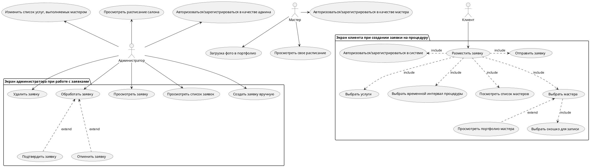

# Схема

```plantuml

@startuml

actor Клиент as cl

actor Администратор as ad

actor Мастер as m

usecase "Загрузка фото в портфолио" as UC4

package "Экран клиента при создании заявки на процедуру" {

usecase "Выбрать услуги" as UC2

usecase "Выбрать временной интервал процедуры" as UC7

usecase "Авторизоваться/зарегистрироваться в системе" as UC8

usecase "Разместить заявку" as UC12

usecase "Отправить заявку" as UC13

usecase "Посмотреть список мастеров" as UC14

usecase "Просмотреть портфолио мастера" as UC5

usecase "Выбрать мастера" as UC6

usecase "Выбрать окошко для записи" as UC11

}

package "Экран администратора при работе с заявками" {

usecase "Подтвердить заявку" as UC9

usecase "Отменить заявку" as UC10

usecase "Обработать заявку" as UC15

usecase "Просмотреть заявку" as UC16

usecase "Просмотреть список заявок" as UC17

usecase "Создать заявку вручную" as  UC18

usecase "Удалить заявку" as UC24

}

usecase "Авторизоваться/зарегистрироваться в качестве админа" as UC19

usecase "Авторизоваться/зарегистрироваться в качестве мастера" as UC20

usecase "Просмотреть свое расписание" as UC21

usecase "Просмотреть расписание салона" as UC22

usecase "Изменить список услуг, выполняемых мастером" as UC23

m --> UC4

m -right-> UC20

m --> UC21

cl --> UC12

UC12 ..> UC2: include

UC12 .left.> UC8: include

UC6 <.. UC5: extend

UC6 ..> UC11: include

UC12 ..> UC14: include

UC12 ..> UC6: include

UC12 ..> UC7: include

UC12 .right..> UC13: include

ad --> UC17

ad --> UC16

ad --> UC15

UC15 <... UC9: extend

UC15 <... UC10: extend

ad --> UC18

ad -up-> UC19

ad -up-> UC22

ad-up-> UC23

ad -right--> UC24

@enduml


```

## Назначение

Диаграмма отображает все виды действий пользователей в системе с уточнением отношений между действиями.